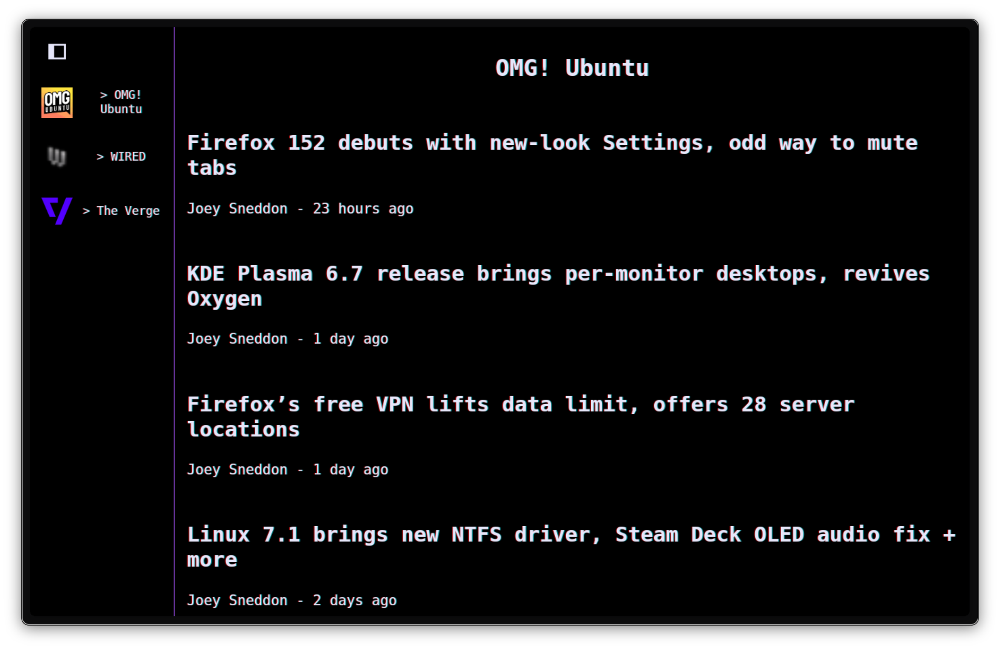

# RSS Ain't Dead

A dead simple self-hosted RSS reader because I didn't like the other options



What to expect:
- No features
- Abandonware in a day or two
- Purple accents

Have a compose:
```yml
rad:
  image: rad:latest
  container_name: rad
  build: .
  volumes:
    - ./feeds.txt:/app/feeds.txt
  ports:
    - 55300:5000
  restart: unless-stopped
```
